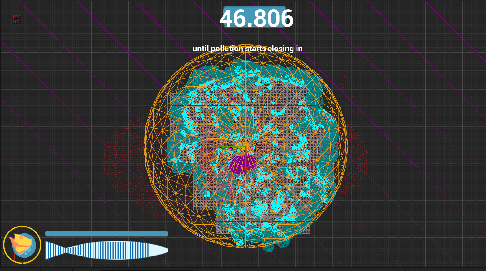
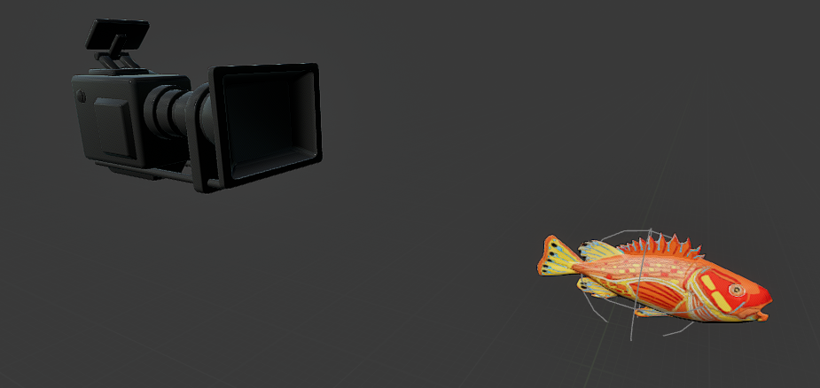
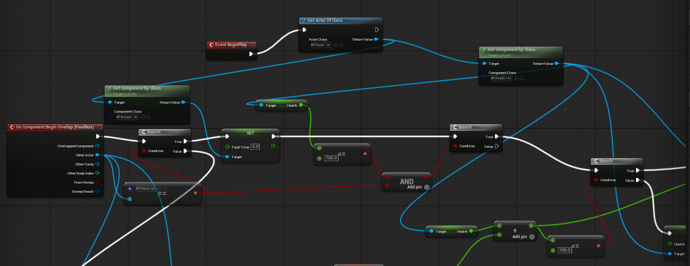
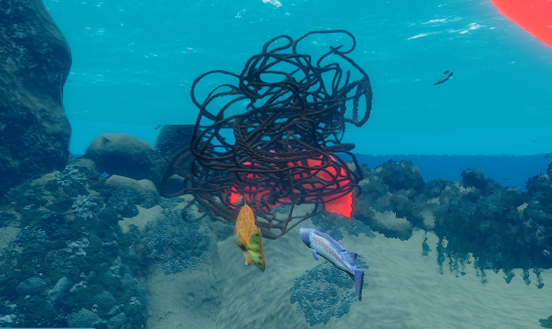
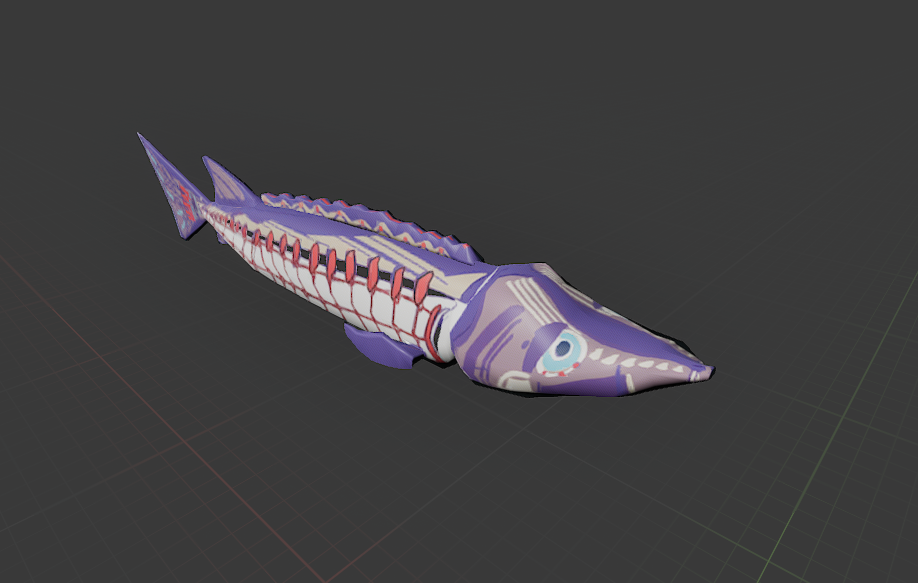
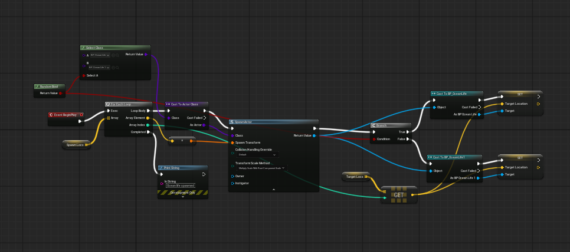
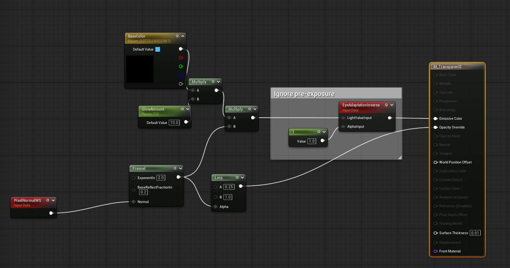
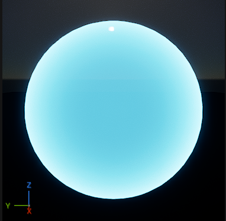

# 🌊 Fading Waters

**Fading Waters** is a 3D survival game developed in **Unreal Engine (Blueprint-only)** that places the player in the role of a fish struggling to survive in a progressively collapsing ocean. The project is designed to raise awareness around **UN SDG 14: Life Below Water**, highlighting the consequences of pollution, overfishing, and human activity on marine ecosystems.

> *This project was developed as part of the MSc Game Development (Programming) – Digital Studio Practice module at Kingston University.*

---

## 🎮 Game Overview

* **Genre:** 3D Survival / Environmental Awareness
* **Platform:** Windows (PC)
* **Engine:** Unreal Engine (Blueprints only)
* **Player Role:** A Yelloweye Rockfish named **Jo**
* **Core Theme:** Environmental degradation and survival under shrinking habitable zones

The player must survive as the safe zone shrinks, manage hunger and health, avoid toxic hazards, and react to dynamic threats such as fishing trawlers and toxic spills. If the player survives the final collapse, the game delivers a **fourth-wall-breaking message** linking the in-game experience to real-world environmental responsibility.

---

## 🧠 Core Mechanics

### 🌐 Zone System (Core Gameplay Loop)

* A dynamic, shrinking **safe zone** representing livable ocean space
* Being outside the zone causes damage over time
* Zone shifts its center between phases to prevent static strategies

**

---

### 🐟 Player Systems

* Custom fish movement inspired by *Fish: Feed and Grow*
* Mouse-based direction control with propulsion-based swimming
* Sprint swimming for emergency escapes
* Designed for accessibility and low cognitive load

**Player Components:**

* Health Component
* Hunger Component
* Wiggle (Struggle) Component

**

---

### ❤️ Health & Hunger

**Health System**

* Shared across all living actors (player, ocean life, food)
* Handles zone damage, toxic damage, and death logic
* Modular and component-driven for reuse

**Hunger System**

* 3 hunger phases:

  1. Healing phase (well-fed)
  2. Neutral phase
  3. Damage phase (starvation)
* Collecting food resets hunger

**

---

### ☣️ Hazards & Events

#### Toxic Zones

* Temporary high-damage areas caused by radioactive waste
* Affect player, food, and marine life
* Designed to disrupt passive play

#### Trawler Event

* Moving fishing net that chases the player
* Triggers a **struggle mini-mechanic** when caught
* Failure results in death

**
**

---

### 🐠 Ocean Life & Environment

* AI-driven marine life with patrol behaviour
* Environmental actors react to pollution and die over time
* Non-interactive ocean objects visually decay instead of disappearing

**

---

## 🔁 Spawner Systems

Multiple spawner actors control world population:

* Health Items (structured payload system)
* Ocean Life (random species + patrol targets)
* Obstacles (toxic trash)
* Events (toxic zones, trawlers)

Spawners dynamically bias spawn locations toward the player to maintain pressure and engagement.

**

---

## 🖥️ UI & UX

Implemented UI Widgets include:

* Main Menu
* Loading Screen
* In-Game HUD (Health, Hunger, Timer)
* Win & Lose Screens

A unique **end-game message system** delivers rotating fourth-wall-breaking messages reinforcing the environmental theme.

**

---

## 🎨 Visual & Material Work

* Custom translucent **force-field material** for zone boundaries
* Fresnel-based glow with exposure-independent visibility
* Visual feedback designed to communicate danger intuitively
**
**

---

## 🤝 Role & Contributions

**Aartem Singh**
*Producer & Sole Game Developer*

Primary responsibilities included:

* Full gameplay programming (Blueprint-only)
* Core systems design (zone, movement, health, hunger)
* UI implementation
* Event & spawner systems
* Version control (GitLab)
* Sprint planning (Jira)
* Communication infrastructure (Discord / Teams)

Due to limited availability of the second assigned developer, all programming responsibilities were handled independently to ensure project continuity.

---

## 🧪 Use of AI & External Assets

* **ChatGPT** was used strictly as a **learning and reference tool** for understanding Unreal Engine concepts, Blueprint nodes, and workflows
* No AI-generated gameplay logic or assets were directly used

**External Assets:**

* Audio sourced from **Pixabay** (royalty-free, no attribution required)

---

## 📌 Project Context

* Academic project for **MSc Game Development (Programming)**
* Developed under **Agile-inspired sprint workflow**
* All work documented through Jira tickets and GitLab commit history

---

## 🏁 Conclusion

Fading Waters represents a complete, systems-driven Unreal Engine project developed under real-world constraints. It demonstrates:

* Independent problem-solving
* Blueprint architecture design
* Production leadership
* Environmental storytelling through mechanics

The project serves both as a technical portfolio piece and a narrative-driven statement on environmental responsibility.

Build for direct play available here:
https://drive.google.com/drive/folders/1oZglQR1Tw6Sf7-_8Gzwv75FHjWEHMTD9?usp=sharing

---

### 🌱 *The ocean in this game may be fictional — the consequences are not.*
